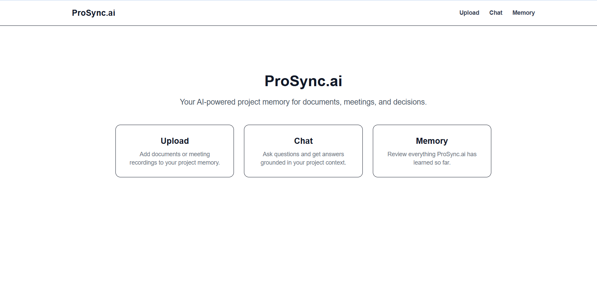

# ProSync.ai  
Evaluation-Driven Project Intelligence Platform

ProSync.ai is an AI-powered system that converts documents and meetings into structured, evaluated, and reusable project knowledge. Instead of treating AI outputs as final, ProSync.ai measures and exposes summary quality, making AI-generated information more reliable, improvable, and production-ready.

---

## What ProSync.ai Does

- Accepts PDFs, text files, and audio recordings
- Extracts or transcribes content
- Generates concise summaries and key points using LLMs
- Evaluates each summary for quality
- Stores evaluated results as long-term project memory
- Enables contextual Q&A and exportable reports
- Automates the entire pipeline using workflows

---

## Why This Matters

Most AI summarization tools stop at generation. ProSync.ai goes further by:
- Measuring quality instead of assuming correctness
- Automating AI pipelines with observability
- Persisting evaluated knowledge for reuse
- Supporting continuous improvement

---

## Key Features

- Document and audio ingestion
- AI summarization with key points
- Quality evaluation using defined metrics
- Workflow orchestration
- Project memory and contextual chat
- Exportable PDF summaries
- Live deployed frontend

---

## Sponsored Technologies Used

### Kestra – Workflow Orchestration  
**Track: The Wakanda Data Award**

Kestra orchestrates the end-to-end processing pipeline. Each upload triggers a Kestra workflow via webhook, coordinating summarization, evaluation, and persistence steps in a controlled, observable manner.

This demonstrates how AI pipelines can be automated reliably instead of being handled by fragile chained API calls.

Kestra enables:
- Workflow-driven AI processing
- Clear execution visibility
- Decoupled orchestration logic
- Production-ready automation

Kestra Docs: https://kestra.io/docs

---

### Oumi – Evaluation-Driven AI  
**Track: The Iron Intelligence Award**

Oumi is integrated to evaluate AI-generated summaries using custom evaluation tasks. Each summary is scored on:

- Faithfulness  
- Relevance  
- Completeness  

Evaluation results are:
- Stored alongside summaries
- Returned in API responses
- Displayed in the UI
- Included in exported reports

This shows how Oumi can be embedded into real applications to move from raw generation to measurable AI quality.

Oumi Docs: https://www.oumi.ai/docs

---

### Vercel – Live Deployment  
**Track: The Stormbreaker Deployment Award**

The frontend is deployed on Vercel using Next.js. Vercel provides fast global delivery, continuous deployment from GitHub, and a clean separation between frontend and backend services.

Live Demo: [Add your Vercel URL here]

Vercel Docs: https://vercel.com/docs

---

## Example Workflow

1. User uploads a document or audio file  
2. Backend extracts or transcribes content  
3. AI generates summary and key points  
4. Oumi evaluates summary quality  
5. Kestra orchestrates execution flow  
6. Results are stored as project memory  
7. User can chat with memory or export PDF  

---

## Screenshots

- Home Page

---

## Tech Stack

Frontend  
- Next.js  
- React  
- Tailwind CSS  
- Vercel deployment  

Backend  
- Node.js  
- Express  
- PDF and audio processing  
- AI APIs  

AI and Workflow  
- Oumi (evaluation)  
- Kestra (orchestration)  

---

## Local Setup

```bash
# Frontend
cd frontend
npm install
npm run dev

# Backend
cd backend
npm install
node index.js
```

What Makes ProSync.ai Different

AI outputs are evaluated, not blindly trusted

Workflows are automated and observable

Knowledge is persistent and reusable

Designed for real-world usage and improvement

License

MIT